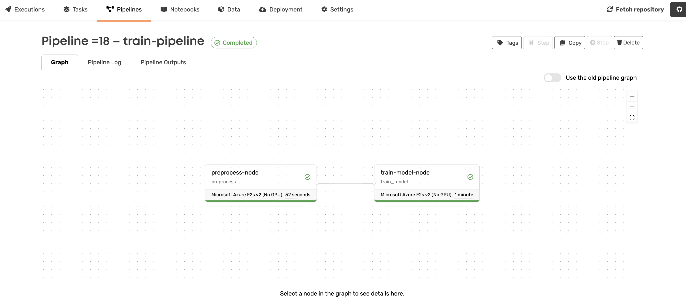
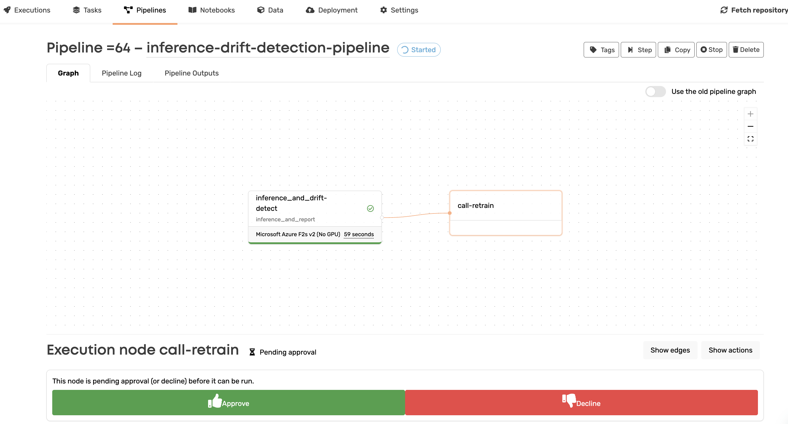
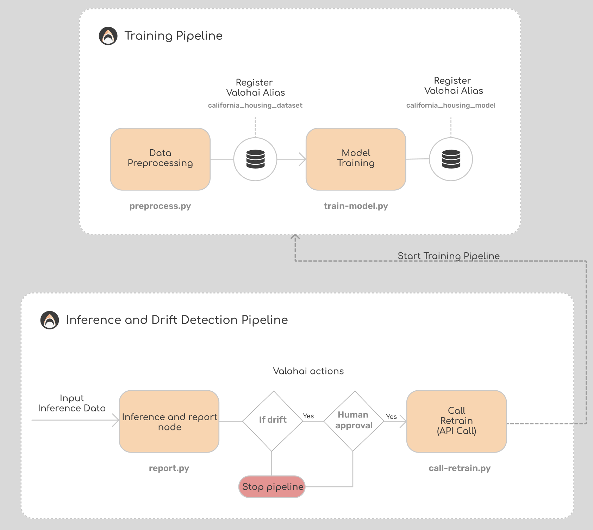

# Drift Detection using EvidentlyAI

This repository demonstrates how to detect data drift in a machine learning pipeline using [EvidentlyAI](https://www.evidentlyai.com/) integrated with Valohai. It showcases the steps to preprocess data, train a model, and monitor data drift, with automated retraining triggered upon drift detection. 

## What is Data Drift?

Data drift in machine learning refers to the change in input data distribution or the relationship between input and output data over time, which can adversely affect model performance. Monitoring and managing drift is crucial to maintaining model accuracy and reliability in production.

## Training Pipeline

This pipeline preprocesses the data and trains the model.

### Pipeline Steps:

1. **Data Preprocessing:**
   - Load the dataset from Valohai inputs or fetch the California Housing dataset if not available.
   - Preprocess the data.
   - Save the processed data to Valohai with an alias.

2. **Model Training:**
   - Load the preprocessed data.
   - Train the model using scikit-learn.
   - Save the trained model with a Valohai alias.

### Training Pipeline view in Valohai:



## Drift Detection Pipeline

This pipeline performs inference with the fine-tuned model and detects data drift using EvidentlyAI.

### Pipeline Steps:

1. **Inference and Drift Detection:**
   - Load the reference dataset, current dataset, and the trained model.
   - Perform inference on the current dataset.
   - Generate data drift reports using EvidentlyAI.
   - Save the drift reports in various formats (JSON, HTML).

2. **Conditional Retraining:**
   - Check if drift is detected based on the reports.
   - If drift is detected, update the status and trigger the retraining pipeline.
   - If no drift is detected, stop the pipeline.

### Drift Detection Pipeline view in Valohai:



## Overall Flow of the Project

1. **Data is preprocessed and stored.**
2. **Model is trained and evaluated.**
3. **Inference is performed on new data to detect drift.**
4. **If drift is detected, the pipeline triggers retraining with human approval.**
5. **If no drift is detected, the pipeline stops.**

### Visual Representation:



## Running on Valohai

### Configuring the Repository:

To run this code on Valohai from your terminal, follow these steps:

1. Install Valohai CLI and utilities:
   ```bash
   pip install valohai-cli
   ```
2. Log in to Valohai from the terminal:
   ```bash
   vh login
   ```
3. Create a directory for your project and initialize a Valohai project:
   ```bash
   mkdir valohai-evidently-example
   cd valohai-evidently-example
   vh project create
   ```
   
4. Clone this repository into your project directory:
   ```bash
   git clone https://github.com/valohai/evidently-example.git .
   ```

### Running Executions:
To run individual steps:

   ```bash
   vh execution run <step-name> --adhoc
   ```

Example to run the preprocessing step:
   ```bash
   vh execution run preprocess --adhoc
   ```
### Running Pipelines:
To run the entire pipeline:

   ```bash
   vh pipeline run <pipeline-name> --adhoc
   ```

Example to run the training pipeline:
   ```bash
   vh pipeline run inference-drift-detection-pipeline --adhoc
   ```

## Working with secrets.

In this project you need to use private token in to use Valohai API in `call-retrain.py`.

Note that you should never include the token in your version control. Instead of pasting it directly into your code, we recommend storing it as a secret environment variable.

You can add environment variables in a couple of ways in Valohai.

- Add the environment variable when creating an execution from the UI (Create Execution -> Environment Variables). The env variable are only available in the execution where it was created.
- Add the project environment variable (Project Settings -> "Environment Variables" tab -> Check "Secret" checkbox). In this case, the env variable will be available for all executions of the project.
